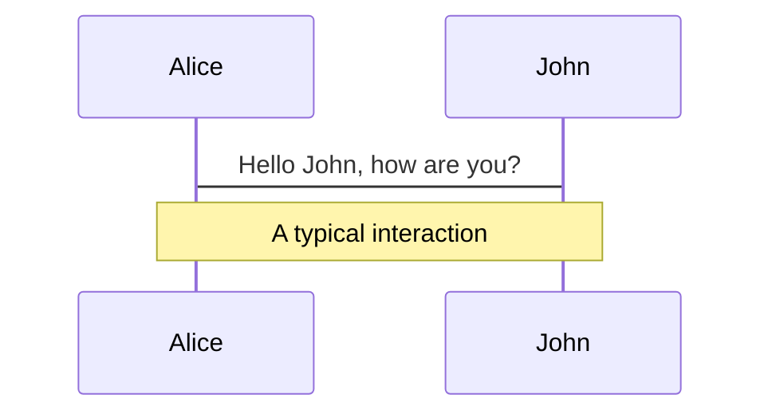
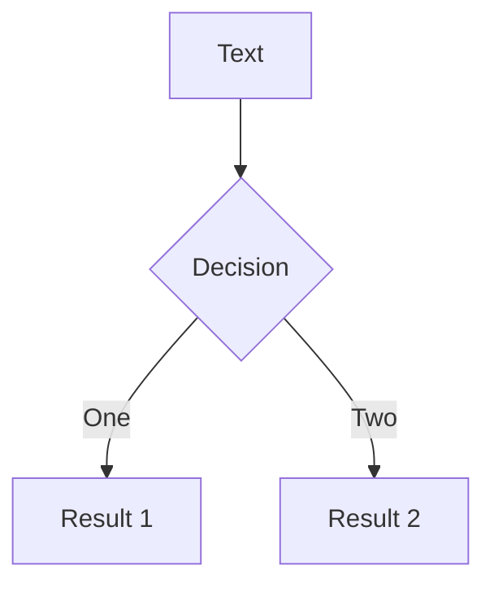

---
# try also 'default' to start simple
theme: seriph
# random image from a curated Unsplash collection by Anthony
# like them? see https://unsplash.com/collections/94734566/slidev
background: https://source.unsplash.com/collection/94734566/1920x1080
# apply any windi css classes to the current slide
class: 'text-center'
# https://sli.dev/custom/highlighters.html
highlighter: shiki
# show line numbers in code blocks
lineNumbers: false
# some information about the slides, markdown enabled
info: |
  ## Slidev Starter Template
  Presentation slides for developers.

  Learn more at [Sli.dev](https://sli.dev)
# persist drawings in exports and build
drawings:
  persist: false
---

# Welcome to Slidev

Presentation slides for developers

<div class="pt-12">
  <span @click="$slidev.nav.next" class="px-2 py-1 rounded cursor-pointer" hover="bg-white bg-opacity-10">
    Press Space for next page <carbon:arrow-right class="inline"/>
  </span>
</div>

<div class="abs-br m-6 flex gap-2">
  <button @click="$slidev.nav.openInEditor()" title="Open in Editor" class="text-xl icon-btn opacity-50 !border-none !hover:text-white">
    <carbon:edit />
  </button>
  <a href="https://github.com/slidevjs/slidev" target="_blank" alt="GitHub"
    class="text-xl icon-btn opacity-50 !border-none !hover:text-white">
    <carbon-logo-github />
  </a>
</div>

<!--
The last comment block of each slide will be treated as slide notes. It will be visible and editable in Presenter Mode along with the slide. [Read more in the docs](https://sli.dev/guide/syntax.html#notes)
-->

---

# Alcance 

El alcance comprende las siguiente máquinas de la Plataforma HackTheBox

| **Máquina** | **Sistema Operativo** | **Dificultad** | **Dirección IP** |
|:-------:|-------------------|------------|--------------|
| Blue    | Microsoft Windows | Fácil      | 10.10.10.40  |
| Blunder | Linux             | fácil      | 10.10.10.191 |
| Devel   | Microsoft Windows | Medio      | 10.10.10.5   |


Considerando la matriz MITRE & ATT&CK

<div class="w-60 relative mt-6">
  <div class="relative w-40 h-40">
    
  </div>  
</div>

<script setup lang="ts">
const final = {
  x: 50,
  y: 40,
  rotate: 0,
  scale: 1.5,
  transition: {
    type: 'spring',
    damping: 10,
    stiffness: 20,
    mass: 2
  }
}
</script>
<style>
  h1 {
  background-color: #2B90B6;
  background-image: linear-gradient(45deg, #4EC5D4 10%, #146b8c 50%);
  background-size: 100%;
  -webkit-background-clip: text;
  -moz-background-clip: text;
  -webkit-text-fill-color: transparent; 
  -moz-text-fill-color: transparent;
}
  </style>

---

# Puertos y Servicios más vulnerables

<div class="pt-5">
  <span class="px-2 py-1 rounded cursor-pointer">
    <span id="puerto1"><mdi:application class="inline"/> &nbsp;&nbsp;Puerto 445 - SMB </span>
    <span id="puerto2">&nbsp;&nbsp;&nbsp;&nbsp;&nbsp;&nbsp;<mdi:application class="inline"/> &nbsp;&nbsp;Puerto 80 - HTTP</span>
    <span id="puerto3">&nbsp;&nbsp;&nbsp;&nbsp;&nbsp;&nbsp;<mdi:application class="inline"/> &nbsp;&nbsp;Puerto 21 - FTP </span>
  </span>
</div>
<br><br>
<br><br>
<div class="chart-wrap">
  <div class="grid horizontal">
  <div class="bar" style="--bar-value:33%;" data-name="Puerto 445"></div>
        <div class="bar" style="--bar-value:33%;--bar-color:#FFCC80" data-name="Puerto 80"></div>
       <div class="bar" style="--bar-value:16%;--bar-color:#9B59B6" data-name="Puerto 21"></div>
        <div class="bar" style="--bar-value:16%;--bar-color:#DC7633" data-name="Otros"></div>

  </div>
</div>
<style>
#puerto1 {
  color: #2B90B6; 
}
#puerto2{
  color: #FFCC80;
}
#puerto3{
  color:#9B59B6;
}
h1 {
  background-color: #2B90B6;
  background-image: linear-gradient(45deg, #4EC5D4 10%, #146b8c 50%);
  background-size: 100%;
  -webkit-background-clip: text;
  -moz-background-clip: text;
  -webkit-text-fill-color: transparent; 
  -moz-text-fill-color: transparent;
}
</style>
<style>
    .chart-wrap {
        --chart-width:420px;
        --grid-color:#aaa;
        --bar-color:#2B90B6;
        --bar-thickness:40px;
        --bar-rounded: 3px;
        --bar-spacing:10px;
        font-family:sans-serif;
        width:var(--chart-width);
    }
    .chart-wrap .title{
        font-weight:bold;
        padding:1.8em 0;
        text-align:center;
        white-space:nowrap;
    }
    /* cuando definimos el gráfico en horizontal, lo giramos 90 grados */
    .chart-wrap.horizontal .grid{
        transform:rotate(-90deg);
    }
    .chart-wrap.horizontal .bar::after{
        /* giramos las letras para horizontal*/
        transform: rotate(45deg);
        padding-top:0px;
        display: block;
    }
    .chart-wrap .grid{
        margin-left:50px;
        position:relative;
        padding:5px 0 5px 0;
        height:100%;
        width:100%;
        border-left:2px solid var(--grid-color);
    }
    /* posicionamos el % del gráfico*/
    .chart-wrap .grid::before{
        font-size:0.8em;
        font-weight:bold;
        content:'0%';
        position:absolute;
        left:-0.5em;
        top:-1.5em;
    }
    .chart-wrap .grid::after{
        font-size:0.8em;
        font-weight:bold;
        content:'100%';
        position:absolute;
        right:-1.5em;
        top:-1.5em;
    }
    /* giramos las valores de 0% y 100% para horizontal */
    .chart-wrap.horizontal .grid::before, .chart-wrap.horizontal .grid::after {
        transform: rotate(90deg);
    }
    .chart-wrap .bar {
        width: var(--bar-value);
        height:var(--bar-thickness);
        margin:var(--bar-spacing) 0;
        background-color:var(--bar-color);
        border-radius:0 var(--bar-rounded) var(--bar-rounded) 0;
    }
    .chart-wrap .bar:hover{
        opacity:0.7;
    }
    .chart-wrap .bar::after{
        content:attr(data-name);
        margin-left:100%;
        padding:10px;
        display:inline-block;
        white-space:nowrap;
    }
</style>

---
layout: two-cols
preload: false
---

# Vulnerabilidades en General

### Vulnerabilidad por versión Desactualizada

- Blue
- Blunder

### Vulnerabilidad por mala configuración

- Devel

<div class="w-60 relative mt-6">
  <div class="relative w-40 h-40">
    
    
    
  </div>
</div>

<!-- vue script setup scripts can be directly used in markdown, and will only affects current page -->
<script setup lang="ts">
const final = {
  x: 0,
  y: 0,
  rotate: 0,
  scale: 1,
  transition: {
    type: 'spring',
    damping: 10,
    stiffness: 20,
    mass: 2
  }
}
</script>


::right::
<br><br><br>

<div class="grafico">
     <div class="sombra"></div>
     <div id="porcion1" class="recorte"><div class="quesito" data-rel="35,5%"></div></div>
     <div id="porcion2" class="recorte"><div class="quesito" data-rel="62,5%"></div></div>
     <div id="porcion3" class="recorte"><div class="quesito" data-rel="120"></div></div>
</div>

<div>
<span id="desact">&nbsp;&nbsp;&nbsp;&nbsp;&nbsp;&nbsp;&nbsp;&nbsp;&nbsp;&nbsp;&nbsp;&nbsp;&nbsp;&nbsp;&nbsp;&nbsp;&nbsp;&nbsp;&nbsp;&nbsp;&nbsp;&nbsp;&nbsp;&nbsp;&nbsp;&nbsp;&nbsp;&nbsp;&nbsp;&nbsp;&nbsp;&nbsp;&nbsp;&nbsp;<mdi:application class="inline"/> &nbsp;&nbsp;Desactualizada </span>
<br>
<span id="conf">&nbsp;&nbsp;&nbsp;&nbsp;&nbsp;&nbsp;&nbsp;&nbsp;&nbsp;&nbsp;&nbsp;&nbsp;&nbsp;&nbsp;&nbsp;&nbsp;&nbsp;&nbsp;&nbsp;&nbsp;&nbsp;&nbsp;&nbsp;&nbsp;&nbsp;&nbsp;&nbsp;&nbsp;&nbsp;&nbsp;&nbsp;&nbsp;&nbsp;&nbsp;<mdi:application class="inline"/> &nbsp;&nbsp;Configuración </span>
</div>
<style>
#desact{
  color:rgba(125, 60, 152,.7);
}
#conf{
  color:rgba(33, 97, 140,.7);
}
h1 {
  background-color: #2B90B6;
  background-image: linear-gradient(45deg, #4EC5D4 10%, #146b8c 50%);
  background-size: 100%;
  -webkit-background-clip: text;
  -moz-background-clip: text;
  -webkit-text-fill-color: transparent; 
  -moz-text-fill-color: transparent;
}
h3{
  background-color: #21618C;
  background-image: linear-gradient(45deg, ##7D3C98 10%, #146b8c 50%);
  background-size: 100%;
  -webkit-background-clip: text;
  -moz-background-clip: text;
  -webkit-text-fill-color: transparent; 
  -moz-text-fill-color: transparent;
}
</style>
<style>
  * {
    box-sizing: border-box;    
}
.grafico {
    height: 200px;
    margin: 1rem auto;
    position: relative;
    width: 200px;
      } 
.recorte {
    border-radius: 50%;
    clip: rect(0px, 200px, 200px, 100px);
    height: 100%;
    position: absolute;
    width: 100%;
     }
.quesito {
    border-radius: 50%;
    clip: rect(0px, 100px, 200px, 0px);
    height: 100%;
    position: absolute;
    width: 100%;
    font-family: monospace;
    font-size: 1.5rem;
     }
.sombra {
    background-color: #fff;
    border-radius: 50%;
    box-shadow: 0 4px 7px rgba(0, 0, 0, 0.3);
    border: 5px solid #000;
    height: 100%;
    position: absolute;
    width: 100%;
     }
#porcion1 {
    transform: rotate(0deg);
     }
#porcion1 .quesito {
    background-color: rgba(33, 97, 140,.7);
    transform: rotate(135deg);
     }
#porcion2 {
    transform: rotate(135deg);
     }
#porcion2 .quesito {
    background-color: rgba(125, 60, 152,.7);
    transform: rotate(180deg);
     }
#porcion1 .quesito:after {
    content: attr(data-rel);
    left: 10%;
    line-height: 5;
    position: absolute;
    top: 5%;
    transform: rotate(225deg);
}
#porcion2 .quesito:after {
    content: attr(data-rel);
    left: 15%;
    position: absolute;
    top: 30%;
    transform: rotate(45deg);
}
#porcion3 {
    transform: rotate(-45deg);
     }
#porcion3 .quesito {
    background-color: rgba(125, 60, 152,.7);
    transform: rotate(45deg);
     }
  </style>


---


# Credenciales Encontradas

> *Durante la auditoría se encontraron credenciales por medio de diferentes fuentes.*

| LSA_SAM | Brute Force | Hash | Plaintext |
| :---: | :---: | :---: | :---: |
|  |  |   |  |


### Consecuencias

1. Las credenciales LSA_SAM suponen un ingreso al sistema *sin la necesidad de tener una contraseña*.
2. Las credenciales por medio de fuerza bruta dan a entender que las contraseñas usadas son  muy *comunes* y por ende previsible por terceros.
3. Con hashes solo se encesitaría tiempo para descubrir sus *secretos*.
4. El texto plano es el mayor riesgo y error que pueda tener un servidor, es una *puerta de libre ingreso* a una cuenta.


<style>
img[alt=imagen_1] { width: 150px; height: 100px; border-radius: 5px 20px 5px; margin: 2px; padding: 2px; display: inline;} 
img[alt=imagen_2] { width: 150px; height: 100px; border-radius: 5px 20px 5px; margin: 2px; padding: 2px; display: inline;} 
img[alt=imagen_3] { width: 150px; height: 100px; border-radius: 5px 20px 5px; margin: 2px; padding: 2px; display: inline;} 
img[alt=imagen_4] { width: 150px; height: 100px; border-radius: 5px 20px 5px; margin: 2px; padding: 2px; display: inline;} 
</style>


---

# Credenciales por registro LSA_SAM
<div grid="~ cols-2 gap-4" >
<div style="margin-top: 40px;">

- Usuario: *Administrator*
  - Riesgo: <span style="color:red;">Alto.</span>
  - Descripción: Acceso como usuario privilegiado, **control total del servidor**.
- Usuario: *haris*
  - Riesgo: <span style="color:green;">Bajo.</span>
  - Descripción: 
- Usuario: *blue*
  - Riesgo: <span style="color:green;">Bajo.</span>
  - Descripción: 
</div>
<div>
  

</div>
</div>

---

<div grid="~ cols-2 gap-4" >
<div style="margin-top: 40px;">

- Usuario: *Administrator*
  - Riesgo: <span style="color:red;">Alto.</span>
  - Descripción: Acceso como usuario privilegiado, **control total del servidor**.
- Usuario: *babis*
  - Riesgo: <span style="color:green;">Bajo.</span>
  - Descripción:
</div>
<div>
  

</div>
</div>

---

# Credenciales por medio de fuerza bruta
<div grid="~ cols-2 gap-4" >
<div style="margin-top: 40px;">

- Usuario: *fergus*
  - Riesgo: <span style="color:orange;">Medio.</span>
  - Descripción: Acceso como administrador del servidor web, puede implicar **interrupciones** en el funcionamiento del servicio web, atentar contra la **confidencialidad** y la **integridad** del servicio.

</div>
<div>
  

</div>
</div>


---

# Credenciales por medio de Hashes
<div grid="~ cols-2 gap-4" >
<div style="margin-top: 40px;">

- Usuario: *Administrator*
  - Riesgo: <span style="color:red;">Alto.</span>
  - Descripción: No se encontró un diccionario en concreto para romper este hash.
- Usuario: *Hugo*
  - Riesgo: <span style="color:orange;">Medio.</span>
  - Descripción: Dicho usuario poseía las mismas credenciales en la máquina local y en otro servicio lo cual facilitó la intrusión, **aumento de privilegios en el sistema**. 
</div>
<div>
  
  

</div>
</div>


---

# Credenciales en texto plano

> Acá faltan pruebas >:v, solo encontré en doctors esto xd

---

# What is Slidev?

Slidev is a slides maker and presenter designed for developers, consist of the following features

- 📝 **Text-based** - focus on the content with Markdown, and then style them later
- 🎨 **Themable** - theme can be shared and used with npm packages
- 🧑‍💻 **Developer Friendly** - code highlighting, live coding with autocompletion
- 🤹 **Interactive** - embedding Vue components to enhance your expressions
- 🎥 **Recording** - built-in recording and camera view
- 📤 **Portable** - export into PDF, PNGs, or even a hostable SPA
- 🛠 **Hackable** - anything possible on a webpage

<br>
<br>

Read more about [Why Slidev?](https://sli.dev/guide/why)

<!--
You can have `style` tag in markdown to override the style for the current page.
Learn more: https://sli.dev/guide/syntax#embedded-styles
-->

<style>
h1 {
  background-color: #2B90B6;
  background-image: linear-gradient(45deg, #4EC5D4 10%, #146b8c 20%);
  background-size: 100%;
  -webkit-background-clip: text;
  -moz-background-clip: text;
  -webkit-text-fill-color: transparent; 
  -moz-text-fill-color: transparent;
}
</style>

---

# Navigation

Hover on the bottom-left corner to see the navigation's controls panel, [learn more](https://sli.dev/guide/navigation.html)

### Keyboard Shortcuts

|     |     |
| --- | --- |
| <kbd>right</kbd> / <kbd>space</kbd>| next animation or slide |
| <kbd>left</kbd>  / <kbd>shift</kbd><kbd>space</kbd> | previous animation or slide |
| <kbd>up</kbd> | previous slide |
| <kbd>down</kbd> | next slide |

<!-- https://sli.dev/guide/animations.html#click-animations -->

<p v-after class="absolute bottom-23 left-45 opacity-30 transform -rotate-10">Here!</p>

---
layout: image-right
image: https://source.unsplash.com/collection/94734566/1920x1080
---

# Code

Use code snippets and get the highlighting directly![^1]

```ts {all|2|1-6|9|all}
interface User {
  id: number
  firstName: string
  lastName: string
  role: string
}

function updateUser(id: number, update: User) {
  const user = getUser(id)
  const newUser = {...user, ...update}  
  saveUser(id, newUser)
}
```

<arrow v-click="3" x1="400" y1="420" x2="230" y2="330" color="#564" width="3" arrowSize="1" />

[^1]: [Learn More](https://sli.dev/guide/syntax.html#line-highlighting)

<style>
.footnotes-sep {
  @apply mt-20 opacity-10;
}
.footnotes {
  @apply text-sm opacity-75;
}
.footnote-backref {
  display: none;
}
</style>

---

# Components

<div grid="~ cols-2 gap-4">
<div>

You can use Vue components directly inside your slides.

We have provided a few built-in components like `<Tweet/>` and `<Youtube/>` that you can use directly. And adding your custom components is also super easy.

```html
<Counter :count="10" />
```

<!-- ./components/Counter.vue -->
<Counter :count="10" m="t-4" />

Check out [the guides](https://sli.dev/builtin/components.html) for more.

</div>
<div>

```html
<Tweet id="1390115482657726468" />
```

<Tweet id="1390115482657726468" scale="0.65" />

</div>
</div>


---
class: px-20
---

# Themes

Slidev comes with powerful theming support. Themes can provide styles, layouts, components, or even configurations for tools. Switching between themes by just **one edit** in your frontmatter:

<div grid="~ cols-2 gap-2" m="-t-2">

```yaml
---
theme: default
---
```

```yaml
---
theme: seriph
---
```


</div>

Read more about [How to use a theme](https://sli.dev/themes/use.html) and
check out the [Awesome Themes Gallery](https://sli.dev/themes/gallery.html).

---
preload: false
---

# Animations

Animations are powered by [@vueuse/motion](https://motion.vueuse.org/).

```html
<div
  v-motion
  :initial="{ x: -80 }"
  :enter="{ x: 0 }">
  Slidev
</div>
```

<div class="w-60 relative mt-6">
  <div class="relative w-40 h-40">
    
    
    
  </div>

  <div 
    class="text-5xl absolute top-14 left-40 text-[#2B90B6] -z-1"
    v-motion
    :initial="{ x: -80, opacity: 0}"
    :enter="{ x: 0, opacity: 1, transition: { delay: 2000, duration: 1000 } }">
    Slidev
  </div>
</div>

<!-- vue script setup scripts can be directly used in markdown, and will only affects current page -->
<script setup lang="ts">
const final = {
  x: 0,
  y: 0,
  rotate: 0,
  scale: 1,
  transition: {
    type: 'spring',
    damping: 10,
    stiffness: 20,
    mass: 2
  }
}
</script>

<div
  v-motion
  :initial="{ x:35, y: 40, opacity: 0}"
  :enter="{ y: 0, opacity: 1, transition: { delay: 3500 } }">

[Learn More](https://sli.dev/guide/animations.html#motion)

</div>

---

# LaTeX

LaTeX is supported out-of-box powered by [KaTeX](https://katex.org/).

<br>

Inline $\sqrt{3x-1}+(1+x)^2$

Block
$$
\begin{array}{c}

\nabla \times \vec{\mathbf{B}} -\, \frac1c\, \frac{\partial\vec{\mathbf{E}}}{\partial t} &
= \frac{4\pi}{c}\vec{\mathbf{j}}    \nabla \cdot \vec{\mathbf{E}} & = 4 \pi \rho \\

\nabla \times \vec{\mathbf{E}}\, +\, \frac1c\, \frac{\partial\vec{\mathbf{B}}}{\partial t} & = \vec{\mathbf{0}} \\

\nabla \cdot \vec{\mathbf{B}} & = 0

\end{array}
$$

<br>

[Learn more](https://sli.dev/guide/syntax#latex)

---

# Diagrams

You can create diagrams / graphs from textual descriptions, directly in your Markdown.

<div class="grid grid-cols-2 gap-10 pt-4 -mb-6">





</div>

[Learn More](https://sli.dev/guide/syntax.html#diagrams)


---
layout: center
class: text-center
---

# Learn More

[Documentations](https://sli.dev) · [GitHub](https://github.com/slidevjs/slidev) · [Showcases](https://sli.dev/showcases.html)
