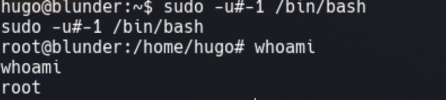

---
# try also 'default' to start simple
theme: seriph
# random image from a curated Unsplash collection by Anthony
# like them? see https://unsplash.com/collections/94734566/slidev
background: images/fondo.jpg
# apply any windi css classes to the current slide
class: 'text-center'
# https://sli.dev/custom/highlighters.html
highlighter: shiki
# show line numbers in code blocks
lineNumbers: false
# some information about the slides, markdown enabled
info: |
  ## Slidev Starter Template
  Presentation slides for developers.

  Learn more at [Sli.dev](https://sli.dev)
# persist drawings in exports and build
drawings:
  persist: false
---

# Informe de Análisis de Vulnerabilidades

Análisis encontrados por el grupo **CiberSecFIIS** a las máquinas de **HTB**

<div class="pt-12">
  <span @click="$slidev.nav.next" class="px-2 py-1 rounded cursor-pointer" hover="bg-white bg-opacity-10">
    Press Space for next page <carbon:arrow-right class="inline"/>
  </span>
</div>

<div class="abs-br m-6 flex gap-2">
  <button @click="$slidev.nav.openInEditor()" title="Open in Editor" class="text-xl icon-btn opacity-50 !border-none !hover:text-white">
    <carbon:edit />
  </button>
  <a href="https://github.com/slidevjs/slidev" target="_blank" alt="GitHub"
    class="text-xl icon-btn opacity-50 !border-none !hover:text-white">
    <carbon-logo-github />
  </a>
</div>

<!--
The last comment block of each slide will be treated as slide notes. It will be visible and editable in Presenter Mode along with the slide. [Read more in the docs](https://sli.dev/guide/syntax.html#notes)
-->

---

#   Participantes

<div grid="~ cols-2 gap-4" >
<div style="align-content:center;">

### Jesús Lujan


### Joseph Mototocache


### Chi Jon Lau Ma


</div>
<div style="align-content:center;">

### Juan Mora


### Luis Suarez


### Salvador Quintana


</div>


</div>

<style>

img {

  padding-left: 60px;

}

</style>


---

# Alcance 

El alcance comprende las siguiente máquinas de la Plataforma HackTheBox

| **Máquina** | **Sistema Operativo** | **Dificultad** | **Dirección IP** |
|:-------:|-------------------|------------|--------------|
| Blue    | Microsoft Windows | Fácil      | 10.10.10.40  |
| Blunder | Linux             | fácil      | 10.10.10.191 |
| Devel   | Microsoft Windows | Medio      | 10.10.10.5   |

<br>
&nbsp&nbsp&nbsp&nbsp


<style>
  h1 {
  background-color: #2B90B6;
  background-image: linear-gradient(45deg, #4EC5D4 10%, #146b8c 50%);
  background-size: 100%;
  -webkit-background-clip: text;
  -moz-background-clip: text;
  -webkit-text-fill-color: transparent; 
  -moz-text-fill-color: transparent;
}

</style>

---

# Matriz MITRE & ATT&CK

MITRE ATT&CK® es una fuente de conocimiento mundial accesible basada en tácticas y técnicas de ataques reales observados alrededor del mundo
<br>

| **Tipo de vulnerabilidad** | **Blue** | **Blunder** | **Devel** |
|:-------:|:-------------------:|:------------:|:--------------:|
| Exploitation for Client Execution | | X | X |
| System Services | X | | |
| Abuse Elevation Control Mechanism   | X | X | X |
| Valid Accounts | | X | |

<div class="w-60 relative mt-6">
  <div class="relative w-40 h-40">
    
  </div>  
</div>

<script setup lang="ts">
const final = {
  x: 350,
  y: 10,
  rotate: 0,
  scale: 1.5,
  transition: {
    type: 'spring',
    damping: 10,
    stiffness: 20,
    mass: 2
  }
}
</script>
<style>
  h1 {
  background-color: #2B90B6;
  background-image: linear-gradient(45deg, #4EC5D4 10%, #146b8c 50%);
  background-size: 100%;
  -webkit-background-clip: text;
  -moz-background-clip: text;
  -webkit-text-fill-color: transparent; 
  -moz-text-fill-color: transparent;
}
</style>

---

# Puertos y Servicios más vulnerables
<div class="pt-5">
  <span class="px-2 py-1 rounded cursor-pointer">
    <span id="puerto1"><mdi:application class="inline"/> &nbsp;&nbsp;Puerto 445 - SMB </span>
    <span id="puerto2">&nbsp;&nbsp;&nbsp;&nbsp;&nbsp;&nbsp;<mdi:application class="inline"/> &nbsp;&nbsp;Puerto 80 - HTTP</span>
    <span id="puerto3">&nbsp;&nbsp;&nbsp;&nbsp;&nbsp;&nbsp;<mdi:application class="inline"/> &nbsp;&nbsp;Puerto 21 - FTP </span>
  </span>
</div>
<br><br>
<br><br>
<div id= "columnas">
<div class="chart-wrap">
  <div class="grid horizontal">
  <div class="bar" style="--bar-value:25%;" data-name="Puerto 445"></div>
        <div class="bar" style="--bar-value:50%;--bar-color:#FFCC80" data-name="Puerto 80"></div>
        <div class="bar" style="--bar-value:25%;--bar-color:#9B59B6" data-name="Puerto 21"></div>
  </div>
</div>

<br><br><br>
</div>

<style>
#puerto1 {
  color: #2B90B6; 
}
#puerto2{
  color: #FFCC80;
}
#puerto3{
  color:#9B59B6;
}
h1 {
  background-color: #2B90B6;
  background-image: linear-gradient(45deg, #4EC5D4 10%, #146b8c 50%);
  background-size: 100%;
  -webkit-background-clip: text;
  -moz-background-clip: text;
  -webkit-text-fill-color: transparent; 
  -moz-text-fill-color: transparent;
}
</style>
<style>
    .chart-wrap {
        --chart-width:420px;
        --grid-color:#aaa;
        --bar-color:#2B90B6;
        --bar-thickness:40px;
        --bar-rounded: 3px;
        --bar-spacing:10px;
        font-family:sans-serif;
        width:var(--chart-width);
    }
    .chart-wrap .title{
        font-weight:bold;
        padding:1.8em 0;
        text-align:center;
        white-space:nowrap;
    }
    /* cuando definimos el gráfico en horizontal, lo giramos 90 grados */
    .chart-wrap.horizontal .grid{
        transform:rotate(-90deg);
    }
    .chart-wrap.horizontal .bar::after{
        /* giramos las letras para horizontal*/
        transform: rotate(45deg);
        padding-top:0px;
        display: block;
    }
    .chart-wrap .grid{
        margin-left:50px;
        position:relative;
        padding:5px 0 5px 0;
        height:100%;
        width:100%;
        border-left:2px solid var(--grid-color);
    }
    /* posicionamos el % del gráfico*/
    .chart-wrap .grid::before{
        font-size:0.8em;
        font-weight:bold;
        content:'0%';
        position:absolute;
        left:-0.5em;
        top:-1.5em;
    }
    .chart-wrap .grid::after{
        font-size:0.8em;
        font-weight:bold;
        content:'100%';
        position:absolute;
        right:-1.5em;
        top:-1.5em;
    }
    /* giramos las valores de 0% y 100% para horizontal */
    .chart-wrap.horizontal .grid::before, .chart-wrap.horizontal .grid::after {
        transform: rotate(90deg);
    }
    .chart-wrap .bar {
        width: var(--bar-value);
        height:var(--bar-thickness);
        margin:var(--bar-spacing) 0;
        background-color:var(--bar-color);
        border-radius:0 var(--bar-rounded) var(--bar-rounded) 0;
    }
    .chart-wrap .bar:hover{
        opacity:0.7;
    }
    .chart-wrap .bar::after{
        content:attr(data-name);
        margin-left:100%;
        padding:10px;
        display:inline-block;
        white-space:nowrap;
    }
</style>
<style>
  #columnas{
   column-count:2;
   column-gap:20px;
  }
</style>


---
layout: two-cols
preload: false
---

# Vulnerabilidades en General

### Vulnerabilidad por versión Desactualizada

- Blue
- Blunder

### Vulnerabilidad por mala configuración

- Devel

<div class="w-60 relative mt-6">
  <div class="relative w-40 h-40">
    
    
    
  </div>
</div>

<!-- vue script setup scripts can be directly used in markdown, and will only affects current page -->
<script setup lang="ts">
const final = {
  x: 0,
  y: 0,
  rotate: 0,
  scale: 1,
  transition: {
    type: 'spring',
    damping: 10,
    stiffness: 20,
    mass: 2
  }
}
</script>


::right::
<br><br><br>

<div class="grafico">
     <div class="sombra"></div>
     <div id="porcion1" class="recorte"><div class="quesito" data-rel="35,5%"></div></div>
     <div id="porcion2" class="recorte"><div class="quesito" data-rel="62,5%"></div></div>
     <div id="porcion3" class="recorte"><div class="quesito" data-rel="120"></div></div>
</div>

<div>
<span id="desact">&nbsp;&nbsp;&nbsp;&nbsp;&nbsp;&nbsp;&nbsp;&nbsp;&nbsp;&nbsp;&nbsp;&nbsp;&nbsp;&nbsp;&nbsp;&nbsp;&nbsp;&nbsp;&nbsp;&nbsp;&nbsp;&nbsp;&nbsp;&nbsp;&nbsp;&nbsp;&nbsp;&nbsp;&nbsp;&nbsp;&nbsp;&nbsp;&nbsp;&nbsp;<mdi:application class="inline"/> &nbsp;&nbsp;Desactualizada </span>
<br>
<span id="conf">&nbsp;&nbsp;&nbsp;&nbsp;&nbsp;&nbsp;&nbsp;&nbsp;&nbsp;&nbsp;&nbsp;&nbsp;&nbsp;&nbsp;&nbsp;&nbsp;&nbsp;&nbsp;&nbsp;&nbsp;&nbsp;&nbsp;&nbsp;&nbsp;&nbsp;&nbsp;&nbsp;&nbsp;&nbsp;&nbsp;&nbsp;&nbsp;&nbsp;&nbsp;<mdi:application class="inline"/> &nbsp;&nbsp;Configuración </span>
</div>
<style>
#desact{
  color:rgba(125, 60, 152,.7);
}
#conf{
  color:rgba(33, 97, 140,.7);
}
h1 {
  background-color: #2B90B6;
  background-image: linear-gradient(45deg, #4EC5D4 10%, #146b8c 50%);
  background-size: 100%;
  -webkit-background-clip: text;
  -moz-background-clip: text;
  -webkit-text-fill-color: transparent; 
  -moz-text-fill-color: transparent;
}
h3{
  background-color: #21618C;
  background-image: linear-gradient(45deg, ##7D3C98 10%, #146b8c 50%);
  background-size: 100%;
  -webkit-background-clip: text;
  -moz-background-clip: text;
  -webkit-text-fill-color: transparent; 
  -moz-text-fill-color: transparent;
}
</style>
<style>
  * {
    box-sizing: border-box;    
}
.grafico {
    height: 200px;
    margin: 1rem auto;
    position: relative;
    width: 200px;
      } 
.recorte {
    border-radius: 50%;
    clip: rect(0px, 200px, 200px, 100px);
    height: 100%;
    position: absolute;
    width: 100%;
     }
.quesito {
    border-radius: 50%;
    clip: rect(0px, 100px, 200px, 0px);
    height: 100%;
    position: absolute;
    width: 100%;
    font-family: monospace;
    font-size: 1.5rem;
     }
.sombra {
    background-color: #fff;
    border-radius: 50%;
    box-shadow: 0 4px 7px rgba(0, 0, 0, 0.3);
    border: 5px solid #000;
    height: 100%;
    position: absolute;
    width: 100%;
     }
#porcion1 {
    transform: rotate(0deg);
     }
#porcion1 .quesito {
    background-color: rgba(33, 97, 140,.7);
    transform: rotate(135deg);
     }
#porcion2 {
    transform: rotate(135deg);
     }
#porcion2 .quesito {
    background-color: rgba(125, 60, 152,.7);
    transform: rotate(180deg);
     }
#porcion1 .quesito:after {
    content: attr(data-rel);
    left: 10%;
    line-height: 5;
    position: absolute;
    top: 5%;
    transform: rotate(225deg);
}
#porcion2 .quesito:after {
    content: attr(data-rel);
    left: 15%;
    position: absolute;
    top: 30%;
    transform: rotate(45deg);
}
#porcion3 {
    transform: rotate(-45deg);
     }
#porcion3 .quesito {
    background-color: rgba(125, 60, 152,.7);
    transform: rotate(45deg);
     }
  </style>


---


# Credenciales Encontradas

> *Durante la auditoría se encontraron credenciales por medio de diferentes fuentes.*

| LSA_SAM | Brute Force | Hash | Plaintext |
| :---: | :---: | :---: | :---: |
|  |  |   |  |

### Consecuencias

1. Las credenciales LSA_SAM suponen un ingreso al sistema *sin la necesidad de tener una contraseña*.
2. Las credenciales por medio de fuerza bruta dan a entender que las contraseñas usadas son  muy *comunes* y por ende previsible por terceros.
3. Con hashes solo se encesitaría tiempo para descubrir sus *secretos*.
4. El texto plano es el mayor riesgo y error que pueda tener un servidor, es una *puerta de libre ingreso* a una cuenta.


<style>
img[alt=imagen_1] { width: 150px; height: 100px; border-radius: 5px 20px 5px; margin: 2px; padding: 2px; display: inline;} 
img[alt=imagen_2] { width: 150px; height: 100px; border-radius: 5px 20px 5px; margin: 2px; padding: 2px; display: inline;} 
img[alt=imagen_3] { width: 150px; height: 100px; border-radius: 5px 20px 5px; margin: 2px; padding: 2px; display: inline;} 
img[alt=imagen_4] { width: 150px; height: 100px; border-radius: 5px 20px 5px; margin: 2px; padding: 2px; display: inline;} 
</style>
<style>
  h1 {
  background-color: #2B90B6;
  background-image: linear-gradient(45deg, #4EC5D4 10%, #146b8c 50%);
  background-size: 100%;
  -webkit-background-clip: text;
  -moz-background-clip: text;
  -webkit-text-fill-color: transparent; 
  -moz-text-fill-color: transparent;
}
h3 {
  background-color: #2B90B6;
  background-image: linear-gradient(45deg, #4EC5D4 10%, #146b8c 50%);
  background-size: 100%;
  -webkit-background-clip: text;
  -moz-background-clip: text;
  -webkit-text-fill-color: transparent; 
  -moz-text-fill-color: transparent;
}
</style>


---

# Credenciales por registro LSA_SAM

<div grid="~ cols-2 gap-4" >
<div style="margin-top: 40px;">

- Usuario: *Administrator*
  - Riesgo: <span style="color:red;">Alto.</span>
  - Descripción: Acceso como usuario privilegiado, **control total del servidor**.
- Usuario: *haris*
  - Riesgo: <span style="color:green;">Bajo.</span>
  - Descripción: Usuario común.
- Usuario: *blue*
  - Riesgo: <span style="color:green;">Bajo.</span>
  - Descripción: Usuario común.
</div>
<div>
  

</div>
</div>

<style>
  h1 {
  background-color: #2B90B6;
  background-image: linear-gradient(45deg, #4EC5D4 10%, #146b8c 50%);
  background-size: 100%;
  -webkit-background-clip: text;
  -moz-background-clip: text;
  -webkit-text-fill-color: transparent; 
  -moz-text-fill-color: transparent;
}
</style>

---

<div grid="~ cols-2 gap-4" >
<div style="margin-top: 40px;">

- Usuario: *Administrator*
  - Riesgo: <span style="color:red;">Alto.</span>
  - Descripción: Acceso como usuario privilegiado, **control total del servidor**.
- Usuario: *babis*
  - Riesgo: <span style="color:green;">Bajo.</span>
  - Descripción: Usuario Común.
</div>
<div>
  

</div>
</div>

---

# Credenciales por medio de fuerza bruta
<div grid="~ cols-2 gap-4" >
<div style="margin-top: 40px;">

- Usuario: *fergus*
  - Riesgo: <span style="color:orange;">Medio.</span>
  - Descripción: Acceso como administrador del servidor web, puede implicar **interrupciones** en el funcionamiento del servicio web, atentar contra la **confidencialidad** y la **integridad** del servicio.

</div>
<div>
  

</div>
</div>

<style>
  h1 {
  background-color: #2B90B6;
  background-image: linear-gradient(45deg, #4EC5D4 10%, #146b8c 50%);
  background-size: 100%;
  -webkit-background-clip: text;
  -moz-background-clip: text;
  -webkit-text-fill-color: transparent; 
  -moz-text-fill-color: transparent;
}
</style>

---

# Credenciales por medio de Hashes
<div grid="~ cols-2 gap-4" >
<div style="margin-top: 40px;">

- Usuario: *Administrator*
  - Riesgo: <span style="color:red;">Alto.</span>
  - Descripción: No se encontró un diccionario en concreto para romper este hash.
- Usuario: *Hugo*
  - Riesgo: <span style="color:orange;">Medio.</span>
  - Descripción: Dicho usuario poseía las mismas credenciales en la máquina local y en otro servicio lo cual facilitó la intrusión, **aumento de privilegios en el sistema**. 
</div>
<div>
  
  

</div>
</div>

<style>
  h1 {
  background-color: #2B90B6;
  background-image: linear-gradient(45deg, #4EC5D4 10%, #146b8c 50%);
  background-size: 100%;
  -webkit-background-clip: text;
  -moz-background-clip: text;
  -webkit-text-fill-color: transparent; 
  -moz-text-fill-color: transparent;
}
</style>
---

# Maquina Blue


<div align="center"></div>

<style>
  h1 {
  background-color: #2B90B6;
  background-image: linear-gradient(45deg, #4EC5D4 10%, #146b8c 50%);
  background-size: 100%;
  -webkit-background-clip: text;
  -moz-background-clip: text;
  -webkit-text-fill-color: transparent; 
  -moz-text-fill-color: transparent;
}
</style>

---


<div grid="~ cols-2 gap-4" >

<div style="margin-top: 40px;">

### Vulnerabilidades encontradas
<br>

- Vulnerabilidad de ejecución remota de código en Windows SMB  

<br>    
      
### Exploit usado
<br>

- MS17-010 EternalBlue SMB Remote Windows Kernel Pool Corruption 

<br>
<div>
  
</div>
</div>
<div>
<br>
  
  

</div>
</div>

<style>
  h3 {
  background-color: #2B90B6;
  background-image: linear-gradient(45deg, #4EC5D4 10%, #146b8c 50%);
  background-size: 100%;
  -webkit-background-clip: text;
  -moz-background-clip: text;
  -webkit-text-fill-color: transparent; 
  -moz-text-fill-color: transparent;
}
</style>

---


# Hardening

<style>
h3 {
  font-size: 1em;
}
h4 {
  font-size: 0.7em;
}
</style>


<div grid="~ cols-2 gap-4" >

<div style="margin-top: 5px;">

<h3>Instalar el parche de seguridad MS17-010</h3>

<h4>- El procedimiento por seguir para realizar la actualización será:</h4>
<h4>  1. Ingresar en Windows Update en la máquina por actualizar.</h4>
<h4>  2. Identificar e instalar el archivo Windows6.1-KB4012215-x64.msu.</h4>  
  
<br>
<br>
      
<h3>Deshabilitar el servicio SMBv1 en la máquina</h3>

<h4>- Podemos hacerlo de dos formas:</h4>
<h4>  1. Deshabilitando smb1 desde funciones y caracteristicas de windows</h4>
<h4>  2. Ingresar el siguiente comando en powershell que modifica el registro: </h4>

<br>

```ts
Set-ItemProperty -Path
"HKLM:\SYSTEM\CurrentControlSet\Services\LanmanServer\Parameters" SMB1 -Type DWORD
-Value 0 -Force

```
   
  
</div>
<div>
  
  
  

</div>
</div>

<style>
  h1 {
  background-color: #2B90B6;
  background-image: linear-gradient(45deg, #4EC5D4 10%, #146b8c 50%);
  background-size: 100%;
  -webkit-background-clip: text;
  -moz-background-clip: text;
  -webkit-text-fill-color: transparent; 
  -moz-text-fill-color: transparent;
}
h3 {
  background-color: #2B90B6;
  background-image: linear-gradient(45deg, #4EC5D4 10%, #146b8c 50%);
  background-size: 100%;
  -webkit-background-clip: text;
  -moz-background-clip: text;
  -webkit-text-fill-color: transparent; 
  -moz-text-fill-color: transparent;
}
</style>

---

# Máquina Blunder

<div align="center"></div>

<style>
img {
  height: 400px;
  width: 550px;
}
h1 {
  background-color: #2B90B6;
  background-image: linear-gradient(45deg, #4EC5D4 10%, #146b8c 50%);
  background-size: 100%;
  -webkit-background-clip: text;
  -moz-background-clip: text;
  -webkit-text-fill-color: transparent; 
  -moz-text-fill-color: transparent;
}
</style>

---

<div grid="~ cols-2 gap-4" >

<div style="margin-top: 10px;">

### Vulnerabilidades encontradas

<br>

- Vulnerabilidad web que permitía el uso de fuerza bruta para autenticarse en el sistema.
- Vulnerabilidad web que permitía la carga de archivos maliciosos.  
- Vulnerabilidad que permite bypass en el sistema y obtener sesión como usuario privilegiado.
      
### CVE asociado

<br>

- CVE-2019-17240
- CVE-2019-16113
- CVE-2019-14287


[CVE-2019-16113](https://github.com/noroh4xy/CVE-2019-16113)

[exploits/47502](https://www.exploit-db.com/exploits/47502)

<br>

<style>

 blockquote {
   margin-top: 90px;
 }
h3 {
  background-color: #2B90B6;
  background-image: linear-gradient(45deg, #4EC5D4 10%, #146b8c 50%);
  background-size: 100%;
  -webkit-background-clip: text;
  -moz-background-clip: text;
  -webkit-text-fill-color: transparent; 
  -moz-text-fill-color: transparent;
}

</style>


  
</div>
<div>
  <br>
   
  ### Pruebas 


  
  <br>
  
  <br>
  

</div>
</div>

---

# Hardening

### Actualización del sudo
Utiizando el comando

```bash
sudo apt-get update && sudo apt-get upgrade
```


### Actualización de Bludit
Utiizando el repositorio de github

https://github.com/philippdormann/bludit-auto-update


<style>
h1 {
  background-color: #2B90B6;
  background-image: linear-gradient(45deg, #4EC5D4 10%, #146b8c 50%);
  background-size: 100%;
  -webkit-background-clip: text;
  -moz-background-clip: text;
  -webkit-text-fill-color: transparent; 
  -moz-text-fill-color: transparent;
}
h3 {
  background-color: #2B90B6;
  background-image: linear-gradient(45deg, #4EC5D4 10%, #146b8c 50%);
  background-size: 100%;
  -webkit-background-clip: text;
  -moz-background-clip: text;
  -webkit-text-fill-color: transparent; 
  -moz-text-fill-color: transparent;
}
  </style>

---

## Evitar el escalamiento de privilegios sin credenciales

Esta técnica implica modificar el archivo **sudoers.true** añadiendo las lineas:

```python
Runas_alias MYGROUP= root, hugo
hugo  ALL=(MYGROUP, !root) /bin/bash
```

<div grid="~ cols-2 gap-4" >

<div>

</div>
<div>

</div>
</div>

<style>
  h2 {
  background-color: #2B90B6;
  background-image: linear-gradient(45deg, #4EC5D4 10%, #146b8c 50%);
  background-size: 100%;
  -webkit-background-clip: text;
  -moz-background-clip: text;
  -webkit-text-fill-color: transparent; 
  -moz-text-fill-color: transparent;
}
  </style>

---

# Máquina Devel

<div align="center"></div>

<style>
img {
  height: 400px;
  width: 550px;
}
h1 {
  background-color: #2B90B6;
  background-image: linear-gradient(45deg, #4EC5D4 10%, #146b8c 50%);
  background-size: 100%;
  -webkit-background-clip: text;
  -moz-background-clip: text;
  -webkit-text-fill-color: transparent; 
  -moz-text-fill-color: transparent;
}
</style>

---

<div grid="~ cols-2 gap-4" >

<div style="margin-top: 10px;">

### Vulnerabilidades encontradas

<br>

- El servidor ftp compartía el directorio donde se ejecutaba el servicio web lo que permitía la carga de archivos maliciosos.
- Vulnerabilidad a nivel de kernel que permitía el escalamiento de privilegios.
      
### CVE asociado

<br>

- CVE-2010-0232

<br>

[https://www.exploit-db.com/exploits/11199](https://www.exploit-db.com/exploits/11199)

</div>

<div>
  
  ### Pruebas 

  
  
  
  

</div>

</div>


<style>

 blockquote {
   margin-top: 160px;
 }
h3 {
  background-color: #2B90B6;
  background-image: linear-gradient(45deg, #4EC5D4 10%, #146b8c 50%);
  background-size: 100%;
  -webkit-background-clip: text;
  -moz-background-clip: text;
  -webkit-text-fill-color: transparent; 
  -moz-text-fill-color: transparent;
}
</style>

---

# Hardening

<br>

Deshabilitar la autenticación FTP anónima
```
Set-WebConfigurationProperty -pspath 'MACHINE/WEBROOT/APPHOST'  
-filter "system.applicationHost/sites/site[@name='Default FTP Site']
/ftpServer/security/authentication/anonymousAuthentication" 
-name "enabled" -value "False"
```
Habilitar la autenticación FTP básica
```
Set-WebConfigurationProperty -pspath 'MACHINE/WEBROOT/APPHOST'  
-filter "system.applicationHost/sites/site[@name='Default FTP Site']
/ftpServer/security/authentication/basicAuthentication" -name "enabled" 
-value "True"
```
Actualizar a una version más nueva del sistema operativo, que cuente con soporte y estar al día con los parches. El SO actual es Windows 7 Build 7600 además que no cuenta con el soporte de Microsoft desde el 14 de enero del 2020.

<style>
  h1 {
  background-color: #2B90B6;
  background-image: linear-gradient(45deg, #4EC5D4 10%, #146b8c 50%);
  background-size: 100%;
  -webkit-background-clip: text;
  -moz-background-clip: text;
  -webkit-text-fill-color: transparent; 
  -moz-text-fill-color: transparent;
}
  </style>
